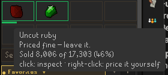

# PocketGE Trading Terminal

**TradingView-style watchlists for Old School RuneScape, in your RuneLite
sidebar.**

Price-move alerts and ranked flip ideas, so the flip finds you instead of you
going looking for it. Every trade is tracked as it fills, with profit after
the 2% tax, and the live chart for anything you're looking at is one click
away on [pocketge.com](https://pocketge.com).

Free. No account. Works in free-to-play.

[](https://buy.stripe.com/aFafZg9ehaaxaVaf3e00000)


*Live, in the client.* The sidebar below is the same panel on its own.


---

## Why another flipping plugin

Most of them answer "what did I make?". This one is built around "what should
I be watching?" — the question you're actually asking between trades.

You build watchlists the way you would on a trading platform: named,
colour-flagged, as many as you like. The plugin watches them while you're off
doing something else and tells you when one of them moves. When you do want an
idea, it has one ranked and waiting, sized to the cash you actually have and
the slots you actually have free. And when you're on the offer screen, the
numbers you need are on that screen, not in a panel you have to look away to.

Nothing here places a trade for you. It shows you numbers and types them into
the offer screen — every offer is still yours to confirm.

---

## What it does

### Watchlists that tell you when something moves


Star anything — from a suggestion, a flip, a search, or the opportunity
finder — into named, colour-flagged lists. Each row shows the live price and
how far it has drifted from its own 24-hour typical, with ▲/▼ chips for
anything sitting at a 5-day high or low.

Set **price alerts** at 10%, 15%, 20% or 30% and RuneLite notifies you when
something swings that far, whether or not the panel is open. If the badges are
too busy for you, there's a switch to turn them all off.

### Flip ideas, ranked and actually affordable


The headline card shows one idea at a time: what to buy or sell, at what
price, how many, **the capital it ties up**, and the profit if it fills, after
tax. Whichever move is bigger leads: the gold a buy would deploy against the
gold a sell would raise, so with a full purse you get buys and with an empty
one you get told to clear the bank. A stack out of your own bank says so on
the card. Buys are sized against three real limits at once — the cash you're
holding, the 4-hour buy limit, and a slice of what the item genuinely trades
in a day, so it never proposes moving more than the market will absorb.

The card leads with the item name and a one-word verb under it saying which
way, then the two prices boxed in the buy and sell colours, the same way
pocketge.com's own Recommended Flip card draws them. The profit is the largest
thing on it, and the figures you actually type — **quantity** and the capital
it ties up — are labelled underneath, in full, never abbreviated.

Between the name and the prices is the site's **flip score**: a number out of
100, a verdict from *Thin* to *Prime*, and a meter. It rates the flip in front
of you, not the item — an engine-cleared pair starts at 20, the net edge is
worth up to 45 and tops out at 3%, and liquidity is worth up to 35 — and it
uses the same arithmetic as the website, so an 87 here is an 87 there. Hover it
for the working, or switch the row off in settings.

The thing the card names is marked in the game too: a white ring goes round that
stack in your bank or inventory on a sell, or round the Buy button of a free
Exchange slot on a buy. One ring, one colour, one place to click — white never
means buy or sell, only "here". When a sell would take a
loss it says so, in words, next to the red figure.

**A pair of chevrons** on the right pages the queue — forward for the next
idea, back to one you passed if it's still on offer, with **how far in you
are** ("3/12") beside the card's last line. They sit apart from the
rest, in pocketge.com's own pager style: everything left of the gap acts on the
item in front of you, the chevrons move you off it. **Hold** parks an idea for
the session, **Block** kills it for good (with an editable never-recommend list
in settings), and the **star** watchlists it.

When you already hold something worth selling, it says so — and when the
plugin watched you buy it, it shows the real P&L against what you paid rather
than just what the stack is worth.

### Help where the offer actually gets placed


*The rings and chips above are drawn by the plugin itself; the Exchange window
behind them is an illustration, not a capture.*

Open a Grand Exchange offer and the plugin marks the control to press next. It
rings the price box first, and a chip on the chatbox offers the exact price —
click it and it's filled in. **The price boxes on the card do the same job**:
click the gold one to type a buy price, the teal one to type a sell price. And
while the Exchange is asking which item to trade, clicking the item on the card
types its name into the search. Once the price is set, the ring **moves to the
quantity box** and the chip offers the quantity: the 4-hour limit for a buy,
the stack you hold for a sell.

Prices are printed in full, with separators. A number you're about to type is
the one place an abbreviation can't be afforded.

### Offers you can read at a glance


The sidebar carries the same eight slots, in the same 4x2 arrangement the
clerk uses, each with a fill bar underneath:


Hover one and it says how the offer is doing and what a click does:



Every active offer gets a coloured border, in-game and in the sidebar's slot
strip: green while it's still competitively priced, red once the market has
moved past it. Hover a red one and it tells you **which price to move to and
which price you're at** — plus whether there's still a margin worth chasing,
or whether you'd be better off taking a different flip entirely.

Pricing one deliberately high? Right-click the slot and tell the plugin to
leave that one alone.

### Your bank, marked


Open your bank and the stacks worth selling right now are outlined in your
theme's sell colour, with the one the card is talking about in white instead.
Hover either for what it fetches after tax, the count and unit price behind
that figure, and — when the plugin watched you buy it — what you paid and on
how many. A legend in the corner of the bank names the two marks, so nothing
has to be remembered.

### What you actually made


A stats header across a window you choose — session, 1h, 4h, 12h, 1d, 1w, 1m
or all time — with profit after tax, **unrealized** P&L on positions still
open, ROI%, gp/hour, session time, and a portfolio value that counts cash,
bank, inventory, worn gear and everything tied up in open offers.


Underneath, the flips that just closed — what sold, how many, and what it made
after tax. One row per trade: the Exchange fills a sell offer in as many chunks
as it finds buyers for, and a sale of 8,218 bars is one thing you did, not the
five rows the order book happened to make of it. Hover one for the buy and sell prices, the tax, and how long the
gold was tied up; click it for the chart. **Flip history** opens the whole
ledger on pocketge.com — every flip you have ever made, newest first, paged,
with all-time profit, tax paid and turnover across the lot. That reads off
this machine over the local bridge, so it needs the bridge switched on.

Flips are matched FIFO per item and booked with the real tax rule (2%, nothing
under 50 gp, capped at 5M, bonds and the classic tools exempt). Partial fills
count. Every closed flip is appended to a permanent on-disk ledger that is
never trimmed, so your history is yours for as long as you keep the file.

When only part of a stack was bought under the plugin's eye, it says so rather
than averaging the two together: the P&L covers the units it watched you buy,
and the rest is reported separately as proceeds. A number that mixes a
measured gain with an unpriced sale is not either one.

### Something to trade when you have nothing

A built-in finder with five angles on the market: **High Vol Margins**, **Low
Vol Margins**, **Biggest Losers (24H)**, **At 5D Highs** and **At 5D Lows**.
Click a row to inspect it, right-click to open its chart or add it to a
watchlist.

### Free-to-play aware

On a free world it hides members-only items and knows you have three offer
slots, not eight — and once those three are busy it stops proposing new flips
you have nowhere to put, and talks about the offers you already have out
instead.

---

## Your data stays yours

- **No account, no login, no telemetry.** Nothing is uploaded, ever.
- The **only** outbound request the plugin makes is to the public OSRS Wiki
  prices API — the same source pocketge.com uses. That happens out of the box,
  because live prices are what the suggestions and watchlists are made of.
  Turning the advisor off stops every outbound request the plugin makes;
  tracking, history and stats keep working offline.
- The optional **local bridge** serves your own flips over `127.0.0.1` so
  pocketge.com *in your browser* can show them. It is off by default, binds to
  loopback only, and never leaves the machine.
- Your watchlists, blocked items and flip history are stored locally.

### Honest tracking

An offer carries its own receipt — the exact units bought and the exact gold
spent, held by the Exchange itself. So when the plugin meets an offer for the
first time, whether you just installed it or the offer has been running for
hours, it reads that receipt and counts what's there. It remembers each slot
per character afterwards, so the same offer is never counted twice however
often you relog or switch accounts. Offers that fill while you're logged out
count too.

What it won't do is guess. A stack sitting in your bank from an offer you
collected before the plugin ever ran leaves nothing behind in the client —
there is no record anywhere of what you paid — so those units are reported as
proceeds, never as profit. And a lot nobody watched fill has no buy time, so
it reports its hold as unknown rather than inventing one.

For the same reason, a stack the plugin never watched you buy is reported as
what it will *sell for*, never as profit. It cannot know what you paid, so it
doesn't pretend to.

---

## Installing

RuneLite → the wrench icon → **Plugin Hub** → search **PocketGE** → Install.

It works out of the box. The local bridge is off until you turn it on; the
advisor is on, which is what fetches live prices — see below.

## Settings worth knowing

| Setting | What it's for |
| --- | --- |
| Flip advisor | Master switch for suggestions, and the only thing that makes outbound requests. On by default; one click turns it off. |
| Re-check every | How often it re-thinks: 5m / 30m / 2h / 8h. |
| Min. profit per suggestion | Hides ideas below your bar. Auto adapts to your cash. |
| Never-recommend list | Items it will never propose. Editable, or use Block. |
| Ask before blocking an item | Confirmation before Block. Turn it off once you're sure. |
| Flips to keep | How many completed flips the panel lists. |
| Buy / sell colours | Which two colours mean buy and sell — the same eight pairs pocketge.com offers, with the same values. Every pair stays readable with red-green colour blindness, and Mono separates by lightness alone for no colour vision at all. |
| Flip score on cards | The 0–100 score and verdict on buy ideas. Off hides the row; the ranking underneath is unchanged. |
| Watchlist badges | Turn the chips, percentages and pulsing borders off. |
| Alert on big price moves | Off / 10% / 15% / 20% / 30%. |
| Mark bank stacks worth selling | Outlines sellable stacks in bank and inventory. |
| Chart clicks reuse your open tab | Off by default: a chart click opens a new tab, every time. Right-click a chart button for **Send to my open PocketGE tab** when you want the page you already have open to change instead. |
| Local website bridge | Off by default. Loopback only. |

## Support the developer

PocketGE is free, there is no account, and nothing about it is paywalled — the
advisor, the watchlists, the tracking and the website all stay that way. If it
has made you gold, here's how to help it keep improving:

- **[Tip the developer](https://buy.stripe.com/aFafZg9ehaaxaVaf3e00000)**
  through Stripe. Any amount helps, and there's no account to make.
- **Star this repository** on GitHub so more flippers find it.
- **Report a problem** or suggest an idea in
  [Issues](https://github.com/grant9008/pocketge-flip-tracker/issues) — a
  screenshot of the card or offer screen you were looking at helps a lot.

Nothing asks you for this inside the game. The plugin has no tip button, no
banner and no nag: you are here because you came looking, which is the only
time it should ever come up.

## Building

Requires JDK 17 to run Gradle (the plugin itself targets Java 11, matching
RuneLite). Use the wrapper — it fetches the right Gradle itself, so nothing
needs installing:

```
./gradlew build          # gradlew.bat build  on Windows
```

CI does this on every push. To run a full client with the plugin loaded, run
`PocketGeTrackerPluginTest.main()` from your IDE.

Where `repo.runelite.net` is unreachable, `./tools/typecheck/check.sh` compiles
everything and runs the tests without it — see that directory's README for what
that does and does not prove.

## License

[BSD 2-Clause](LICENSE)
